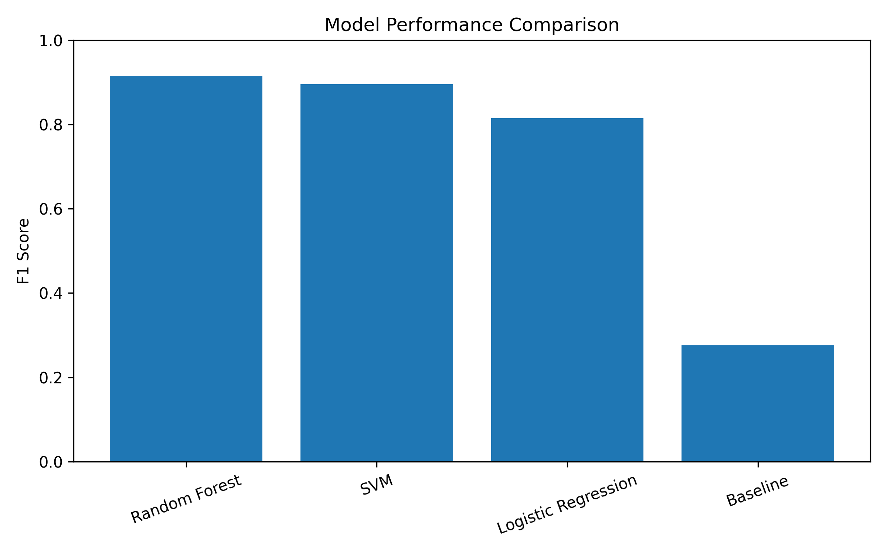
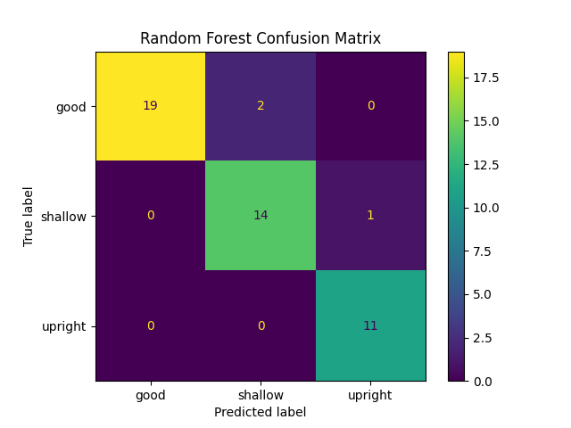
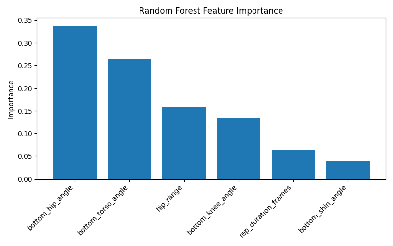

# AI Exercise Form Analyzer

An AI-powered computer vision system that analyzes Bulgarian split squat form using pose detection and machine learning. The system detects squat repetitions from video, extracts biomechanical features, and classifies each rep as good, shallow, or upright (no slight tilt in torso) while providing feedback.

# What it Does

This project implements a computer vision and machine learning pipeline that evaluates Bulgarian split squat form from side-view video. Using MediaPipe pose detection, the system tracks key body landmarks including the shoulder, hip, knee, and ankle. From these landmarks it extracts biomechanical features such as knee angle, hip angle, torso angle, shin angle, rep duration, and hip movement range. These features are used to train a machine learning classifier that predicts squat form quality. The trained model then runs in a real-time inference system that detects repetitions, evaluates each rep, and provides feedback to the user.

# Quick Start

1. Clone the repository.
git clone <repo-url> **********FIXXXXXXXX
cd gym-form-ai

2. Install dependencies
pip install -r requirements.txt

3. Run the real-time squat analyzer
python src/realtime_predict.py

4. Perform Bulgarian split squats in front of the camera then press ESC to stop recording. The system will output predicted squat form and feedback for each rep.

# Video Links

Demo Video:[Watch the demo video](videos/demo_video.mp4)

Technical Walkthrough:
https://youtu.be/qFY2hY0H96Q

# Evaluation

Multiple machine learning models were evaluated including Logistic Regression, Support Vector Machine, and Random Forest Classifiers. Performance was measured using accuracy, precision, recall, and F1 score.

Visual for performance among diffferent models:

| Model | Accuracy | Precision | Recall | F1 Score |
|------|------|------|------|------|
| Baseline | 0.447 | 0.200 | 0.447 | 0.276 |
| Logistic Regression | 0.809 | 0.827 | 0.809 | 0.813 |
| SVM | 0.851 | 0.851 | 0.851 | 0.849 |
| Random Forest | **0.915** | **0.919** | **0.915** | **0.916** |

The Random Forest classifier achieved the best performance and was selected as the final model.

Additional evaluation included:

- Confusion matrix analysis:

- Feature importance visualization:

- 5-fold cross validation
- Hyperparameter tuning with GridSearchCV

# Individual Contributions

This project was completed individually by Angelica Deribeaux.
